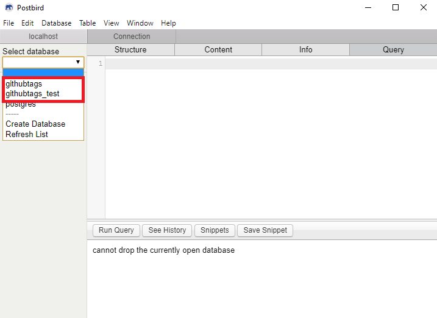
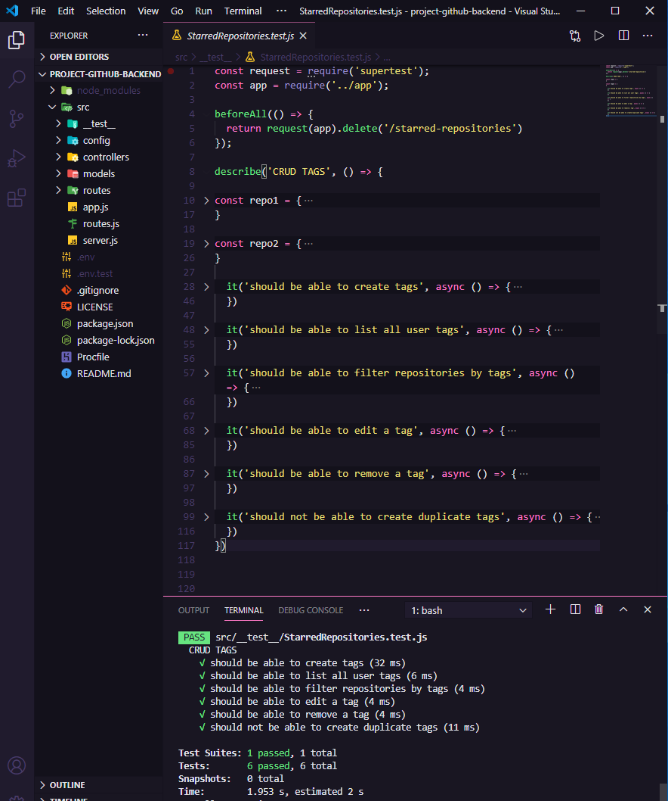

# project-github-backend
project-github-backend

--------------------------------------------------------------

## 🔧 Configurações

Para clonar o projeto via HTTPS, execute este comando:

    git clone https://github.com/maiconboer/project-github-backend.git

Após a finalização do clone, instale as dependências com o comando:

    yarn

  --------------------------------------------------------------
    

**Com as instalações das dependencias finalizadas, vamos criar 2 arquivos na raiz do projeto, as variáveis de ambiente (um para desenvolvimento e outro para testes com jest):**  

      1º - nome: .env  
      conteudo: USER_DB=seu_usuario  
                PASSWORD_DB=sua_senha 
                HOST_DB=localhost  
                PORT_DB=5432  
                DATABASE_DB=githubtags  
--

      2º - nome: .env.test  
          conteudo: USER_DB=seu_usuario  
                    PASSWORD_DB=sua_senha 
                    HOST_DB=localhost  
                    PORT_DB=5432  
                    DATABASE_DB=githubtags_test


**Com a criação das variáveis de ambiente, vamos criar os bancos de dados (um para desenvolvimento e outro para testes com jest)**

Neste projeto utilizaremos **Postgres**, crie 2 bancos de dados:  

**1º - nome: githubtags**    
**2º - nome: githubtags_test**    

<p align=center>  

</p>

Rode os mesmos comandos para ambos, com exceção do nome, são idênticos:  
    
    CREATE EXTENSION IF NOT EXISTS "uuid-ossp";

    CREATE TABLE starred (
      id                uuid DEFAULT uuid_generate_v4() PRIMARY KEY,
      user_id           text NOT NULL,
      repo_id  	    text NOT NULL,
      tags              text NOT NULL,
      description	    text,
      name		    text NOT NULL,
      url		    text NOT NULL
    );

    ALTER TABLE starred ADD CONSTRAINT unique_value UNIQUE (user_id, repo_id, tags);


--------------------------------------


## 👷 Execução 

**Para startar o servidor (para utilizar com nosso frontend), rode o comando:**

    yarn dev

**Para realizar os testes presentes na aplicação, rode o comando:**

    yarn test


**Quais testes o backend executa?**

**```should be able to create tags```**   
**```should be able to list all user tags```**   
**```should be able to filter repositories by tags```**   
**```should be able to edit a tag```**   
**```should be able to remove a tag```**   
**```should not be able to create duplicate tags```**   

<p align=center>  

</p>

### Este backend vai se integrar com o frontend do link que segue abaixo:

 [https://github.com/maiconboer/project-github](https://github.com/maiconboer/project-github)

